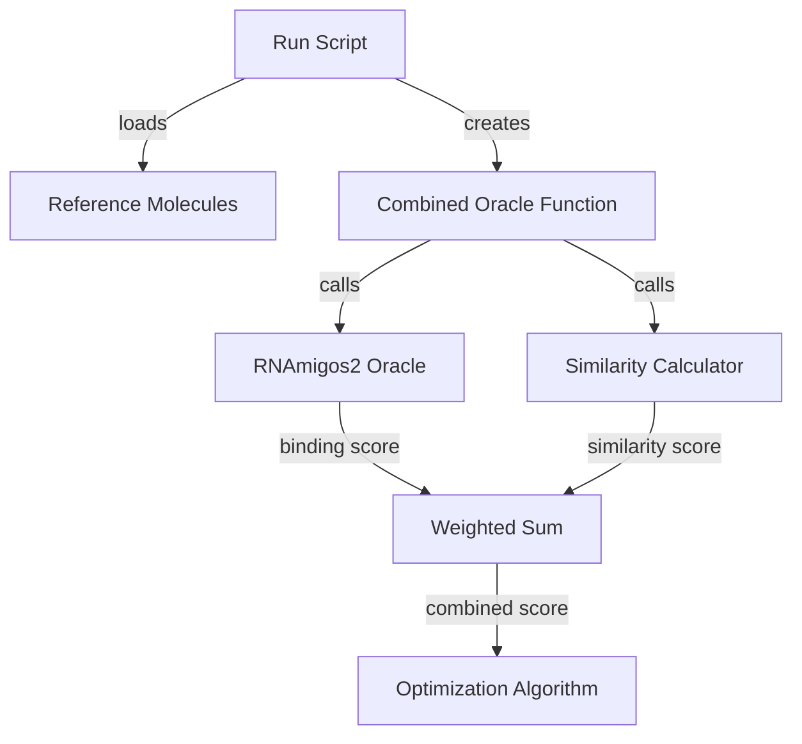

# Combined Similarity-Binding Objective Implementation

## Overview

Add a similarity-based penalty to the RNAmigos2 oracle using a weighted sum approach. This will prevent optimized molecules from becoming unrealistic by maintaining similarity to reference molecules (either starting molecules or known drugs).

## Architecture



## Implementation Steps

### 1. Extend Oracle Module

**File**: [`rnamigos2_minimal/oracle.py`](rnamigos2_minimal/oracle.py)

Add two new functions:

**a) Similarity computation function**

- Compute Tanimoto similarity using Morgan fingerprints (radius=2, 2048 bits)
- Compare candidate molecule to all reference molecules
- Return maximum similarity (closest match)
- Handle invalid SMILES gracefully (return 0.0)

**b) Combined oracle function**

- Accept parameters: `smi`, `reference_smiles`, `similarity_weight`, `binding_weight`
- Call `rnamigos2_oracle()` for binding score
- Call similarity function for similarity score
- Return: `binding_weight * binding_score + similarity_weight * similarity_score`
- If no reference molecules provided, fall back to pure binding score

### 2. Update All Run Scripts

Modify these four scripts to support combined objective:

- [`rnamigos2_minimal/run_graphga.py`](rnamigos2_minimal/run_graphga.py)
- [`rnamigos2_minimal/run_gp_bo.py`](rnamigos2_minimal/run_gp_bo.py)
- [`rnamigos2_minimal/run_smiles_ga.py`](rnamigos2_minimal/run_smiles_ga.py)
- [`rnamigos2_minimal/run_reinvent.py`](rnamigos2_minimal/run_reinvent.py)

**Changes to each script**:

**a) Add new command-line arguments**:

```python
--use_combined_objective (flag, default: False)
--reference_file (str, optional: path to reference SMILES file)
--similarity_weight (float, default: 0.3)
--binding_weight (float, default: 0.7)
```

**b) Add reference molecule loading logic**:

```python
if args.use_combined_objective:
    if args.reference_file:
        # Load from specified file
    else:
        # Use starting molecules from args.smi_file
```

**c) Create oracle based on flag**:

```python
if args.use_combined_objective:
    oracle = lambda smi: combined_rnamigos2_similarity_oracle(
        smi=smi,
        reference_smiles=reference_smiles,
        similarity_weight=args.similarity_weight,
        binding_weight=args.binding_weight
    )
else:
    oracle = tpp_rnamigos2_oracle
```

### 3. Update Output Directories

When combined objective is used, modify output directory naming:

- Add `_combined` suffix to output directory
- Example: `opt_results/graph_ga_combined`
- This prevents overwriting pure binding optimization results

### 4. Testing Strategy

**Quick validation test**:

- Run Graph GA with 1000 oracle calls using combined objective
- Compare top molecules to pure binding optimization
- Verify similarity scores are higher while maintaining reasonable binding scores

**Command example**:

```bash
python run_graphga.py \
  --use_combined_objective \
  --max_oracle_calls 1000 \
  --similarity_weight 0.3 \
  --binding_weight 0.7 \
  --output_dir opt_results/graph_ga_combined_test
```

## Key Design Decisions

1. **Default weights**: 0.7 binding + 0.3 similarity (prioritize binding but constrain drift)
2. **Similarity metric**: Tanimoto similarity with Morgan fingerprints (standard in drug discovery)
3. **Reference selection**: Max similarity to any reference (not average) to allow some exploration
4. **Backward compatibility**: Original behavior preserved when flag not used

## Files Modified

- [`rnamigos2_minimal/oracle.py`](rnamigos2_minimal/oracle.py) - Add similarity functions
- [`rnamigos2_minimal/run_graphga.py`](rnamigos2_minimal/run_graphga.py) - Add combined objective support
- [`rnamigos2_minimal/run_gp_bo.py`](rnamigos2_minimal/run_gp_bo.py) - Add combined objective support  
- [`rnamigos2_minimal/run_smiles_ga.py`](rnamigos2_minimal/run_smiles_ga.py) - Add combined objective support
- [`rnamigos2_minimal/run_reinvent.py`](rnamigos2_minimal/run_reinvent.py) - Add combined objective support

## Dependencies

All required dependencies (RDKit, NumPy) are already in the environment. No additional packages needed.